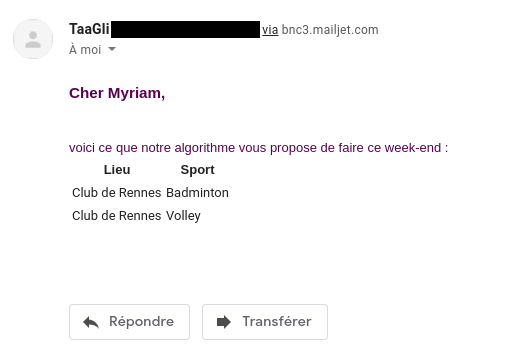

# TAA-GLI - Projet

Ce document reprend les informations concernant le projet TAA-GLI de **Pavy Myriam** et **Chertier Kevin**.

Il comprend cinq parties principales, une présentation du sujet, un guide d’installation, un guide d'utilisation, un rappel des fonctionnalités implémentées ainsi que des fonctionnalités non-implémentées.

## Présentation

Nous avons choisi de créer une application de planification de weekend **WeekendPlanner**.

Cette application permet à un utilisateur inscrit de recevoir des suggestions d'activités de plein air pour le weekend suivant, en fonction de la météo. 

## Installation et présentation technique

Pour le *BackEnd*, le projet utilise le framework SpringBoot, relié à une base de données PostgreSQL.

La persistance est assurée grâce à Spring Data JPA. Mapstruct permet de faciliter le lien entre les DTO et les entités.

Un webservice RESTful est fourni au *FrontEnd*, utilisant lui Angular.

Une page Swagger est disponible, reprenant les points d'API :
> [Swagger](http://localhost:9090/swagger-ui.html#/ "http://localhost:9090/swagger-ui.html#/")

Les dépendances sont gérées grâce à Maven.

Après avoir cloné en local le projet, il est nécessaire de créer une base de données Postgres.

Les informations de connexion à la base de données sont à fournir dans le fichier `src/main/resources/application.properties`

    spring.datasource.url=jdbc:postgresql://localhost:5432/weekenddb
	spring.datasource.username = postgres
	spring.datasource.password = admin

Le projet java peut être lancé directement depuis l'IDE.

 
 Après avoir installé **Angular CLI**, on accède au Front en exécutant la commande `ng serve --open`
 
## Guide d'utilisation

 - En arrivant sur l'application, l'utilisateur a le choix entre s'inscrire et se connecter.
 - Une fois enregistré et connecté, l'utilisateur a accès à une page d'ajout de lieu, et de sport.

 Il peut ajouter un lieu en choisissant une région parmi la liste, puis un département, et enfin une ville. Il peut ensuite sauvegarder la ville choisie.
 Les régions, départements et villes sont récupérés dynamiquement à partir de l'API du gouvernement.  [geo.api.gouv](https://geo.api.gouv.fr/ "https://geo.api.gouv.fr/")

 Il peut aussi ajouter un sport, et configurer des conditions pour la pratique de ce sport, comme le temps idéal (ensoleillé, pas de pluie), la vitesse du vent minimale et maximale ou la houle si c'est un sport aquatique.
- L'utilisateur connecté peut aussi accéder à une page pour associer une localisation à un sport, ces deux éléments préalablement enregistrés. 

 Chaque mardi à 20h, les utilisateurs reçoivent un mail récapitulant les possibilités de sortie le weekend suivant, en fonction des sports et lieux associés, et de la météo prévue. Pour le cas *absence de pluie*, on considère les cas *nuageux* et *brouillard*.
 
 Les mails sont envoyés grâce à Mailjet et son API.

Voici un exemple de mail reçu :

## Fonctionnalités implémentées
- Un système de connexion rudimentaire est présent, permettant à un couple login/password de s'identifier.
- L'utilisateur peut choisir successivement une région, un département puis une ville comme lieu pour son activité.
- L'utilisateur peut renseigner un sport, et définir des conditions météo pour la pratique de cette activité, telles que le temps, la vitesse du vent ou la houle.
- L'utilisateur peut aussi associer un lieu et un sport.
- L'utilisateur reçoit un mail lui indiquant quels sports il peut pratiquer le weekend suivant, en fonction de ses lieux enregistrés et de la météo.

## Fonctionnalités non implémentées
Par manque de temps, et par surcharge de travail générale au long de cette année, l'ensemble des fonctionnalités prévues n'a pas été implémenté.

- Il était prévu de pouvoir sélectionner un lieu à partir d'un point sur une carte, l'API météo choisie nous permettant de récupérer la météo en renseignant des coordonées géographiques.
- Un utilisateur ne peut pas actuellement supprimer ou modifier un sport ou lieu ajouté. Certaines méthodes étant présentes dans le Back mais non reliées au Front.
- L'intégration de Spring Security n'a pas été effectuée, une tentative a été faite avec la classe `BasicAuthConfiguration.java`
- Le passage sur Docker, n'a pas été effectué.
- La remontée des erreurs, distinction entre erreur internes et utilisateur est incomplète. 
